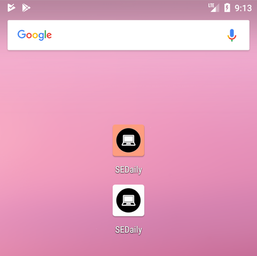
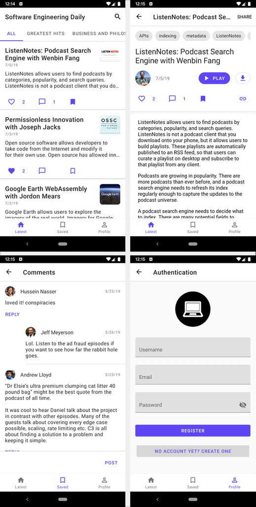

# SEDaily-Android

[](https://softwareengineeringdaily.com/)

A player for the Software Engineering Daily Podcast

Getting Started
---------------
The app has 2 build types: debug and release with minor differences between both builds. [`Stetho`](http://facebook.github.io/stetho/) for example is only enabled for debug builds. And [`Timber`](https://github.com/JakeWharton/timber) to log warnings and errors as Crashlytics non-fatal crashes in release builds.

We also use different app icons for debug and release builds and you can keep both builds on your device and run them side by side.




The app is 100% [Kotlin](http://kotlinlang.org) and we think it is better to keep it this way.

We use [`Koin`](https://insert-koin.io) which is a lightweight dependency injection framework to manage all dependencies. And [`Kotlin Coroutines`](https://kotlinlang.org/docs/reference/coroutines-overview.html) for asynchronous work. We also use `Kotlin Coroutines` with [`Room`](https://developer.android.com/topic/libraries/architecture/room) and [`Retrofit`](https://square.github.io/retrofit/).

Cloning the Project
-------------------
```sh
$ git clone https://github.com/SoftwareEngineeringDaily/SEDaily-Android.git
$ cd SEDaily-Android
```

And then compile the project with Gradle using
```sh
./gradlew build
```

Screenshots
-----------


Libraries Used
--------------
* [Foundation][0] - Components for core system capabilities, and Kotlin extensions.
  * [AppCompat][1] - Degrade gracefully on older versions of Android.
  * [Android KTX][2] - Write more concise, idiomatic Kotlin code and helper functions for easy integration with coroutines.
  * [exoplayer][6] to manage the media playback.
* [Architecture][10] - A collection of libraries that help design robust, testable, and maintainable apps.
  * [Lifecycles][12] - Create a UI that automatically responds to lifecycle events.
  * [LiveData][13] - Build data objects that notify views when the underlying data changes.
  * [Navigation][14] - Handle everything needed for in-app navigation.
  * [Room][16] - Access app's SQLite database with in-app objects and compile-time checks.
  * [ViewModel][17] - Store UI-related data that isn't destroyed on app rotations.
* Third party
  * [Glide][90] for image loading.
  * [Epoxy][3] for building complex screens in a RecyclerView.
  * [Koin][4] a lightweight dependency injection framework to manage all dependencies.
  * [Retrofit][5] a type-safe HTTP client for Android and Java.
  * [Timber][7] to log warnings and errors as Crashlytics non-fatal crashes in release builds.
  * [Kotlin Coroutines][91] for managing background threads with simplified code and reducing needs for callbacks.

[0]: https://developer.android.com/jetpack/components
[1]: https://developer.android.com/topic/libraries/support-library/packages#v7-appcompat
[2]: https://developer.android.com/kotlin/ktx
[3]: https://github.com/airbnb/epoxy
[4]: https://insert-koin.io
[5]: https://square.github.io/retrofit/
[6]: https://exoplayer.dev
[7]: https://github.com/JakeWharton/timber
[10]: https://developer.android.com/jetpack/arch/
[12]: https://developer.android.com/topic/libraries/architecture/lifecycle
[13]: https://developer.android.com/topic/libraries/architecture/livedata
[14]: https://developer.android.com/topic/libraries/architecture/navigation/
[16]: https://developer.android.com/topic/libraries/architecture/room
[17]: https://developer.android.com/topic/libraries/architecture/viewmodel
[90]: https://bumptech.github.io/glide/
[91]: https://kotlinlang.org/docs/reference/coroutines-overview.html

Upcoming features
-----------------
Interested in seeing a particular feature implemented in this app? Please open a new [issue](https://github.com/SoftwareEngineeringDaily/software-engineering-daily-android/issues) with a [feature proposal](https://github.com/SoftwareEngineeringDaily/software-engineering-daily-android/blob/master/CONTRIBUTING.md#feature-proposals).

Contributing
------------
Checkout [CONTRIBUTING.md](https://github.com/SoftwareEngineeringDaily/software-engineering-daily-android/CONTRIBUTING.md) for details.
